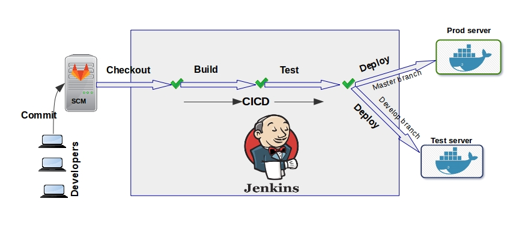

# CI/CD with Jenkins Multibranch Pipeline

- Scripts for installing: Jenkins, GitLab-CE, Docker

- Deploy app to multibranch (develop, master)

- Syncing code to web server (Nginx)

- Deploy app with LEMP docker

